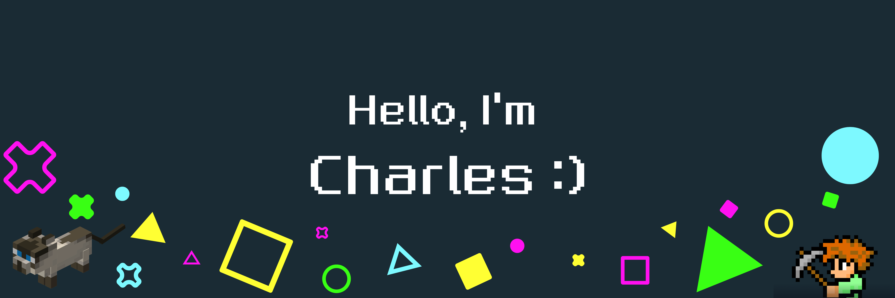

---

# Hey there 👋

## 🇧🇷 PT-BR

Olá! Eu sou o Charles, desenvolvedor back-end júnior.

Gosto de criar soluções organizadas e estou sempre evoluindo com esforço e dedicação.
Aqui a formalidade é na medida certa — porque criatividade + diversão também fazem parte do processo :D

---

## 🇺🇸 EN

Hello! I'm Charles, a junior back-end developer.

I enjoy building organized solutions and continuously improving through effort and dedication.
Here, formality is kept at the right level — because creativity + fun are also part of the process :D

---

## ⭐ Featured Projects
- Coming soon 🚧

---

## 💻 Back-end Stack

---

## 🎨 Front-end Basics

---

## 🛠 Tools & Environment

---

## 📚 Currently Learning

📖 **Udemy Course**
- Java Fundamentals  
- Object-Oriented Programming (OOP)  
- Functional Programming  
- MySQL & MongoDB  
- Spring Boot  
- JPA & Hibernate  
- JavaFX  

🔎 **Current focus**
- REST APIs  
- Database modeling  
- Clean Code  

---

## 🌐 Portfolio

  

    I'm building my portfolio website to showcase my projects. 
    Coming soon 🚧 — work in progress.
  

  

 

> No matter what your ability is, effort is what ignites it.
